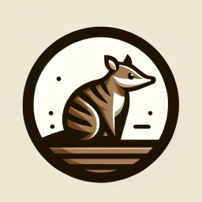

# Numbast

## Overview
Numbast = Numba + AST (Abstract Syntax Tree)

Numbast's mission is to establish an automated pipeline that converts CUDA APIs into Numba bindings. On a high level, top-level declarations are read from CUDA C++ header files, serialized as string and passed to python APIs. Numba binding generators then iterate through these bindings and make Numba extensions for each of the APIs.

There are several subcomponents: AST_Canopy, Numbast and a set of Numba Extensions

- [ast_canopy](ast_canopy/README.md): CUDA Header Parser that depends on clangTooling
- [numbast](numbast/README.md): Numba Binding Generator
- [numba_extensions](numba_extensions/README.md): a set of Numba bindings for several CUDA libraries using Numbast

## Get Started

First, install conda environment and activate:

```bash
conda env create -f conda/environment.yaml && \
  conda activate numbast
```

Next, install all subcomponents:

```bash
pip install ast_canopy/ \
  numbast/ \
  numba_extensions/bf16 \
  numba_extensions/fp16 \
  numba_extensions/curand_device \
  numba_extensions/curand_host
```

Validate the installation by running the tests:

```bash
pytest ast_canopy/ numba_extensions/
```

### Example

Given a C++ struct (or function) declaration:
```c++
struct __attribute__((aligned(2))) __myfloat16
{
private:
  half data;

public:
  __host__ __device__ __myfloat16();

  __host__ __device__ __myfloat16(double val);

  __host__ __device__ operator double() const;
};

__host__ __device__ __myfloat16 operator+(const __myfloat16 &lh, const __myfloat16 &rh);

__device__ __myfloat16 hsqrt(const __myfloat16 a);
```

Numbast can convert it into Numba bindings:

```python
import os
from ast_canopy import parse_declarations_from_source
from numbast import bind_cxx_struct, bind_cxx_function, MemoryShimWriter

from numba import types, cuda
from numba.core.datamodel.models import PrimitiveModel

import numpy as np

# Use `AST_Canopy` to parse demo.cuh as AST, read all declarations from it.
source = os.path.join(os.path.dirname(__file__), "demo.cuh")
# Assume your machine has a GPU that supports "sm_80" compute capability,
# parse the header with sm_80 compute capability.
structs, functions, *_ = parse_declarations_from_source(source, [source], "sm_80")

shim_writer = MemoryShimWriter(f'#include "{source}"')

# Make Numba bindings from the declarations.
# New type "myfloat16" is a Number type, data model is PrimitiveModel.
myfloat16 = bind_cxx_struct(shim_writer, structs[0], types.Number, PrimitiveModel)
bind_cxx_function(shim_writer, functions[0])
hsqrt = bind_cxx_function(shim_writer, functions[1])
```

`myfloat16` struct can now be used within Numba:

```python
@cuda.jit(link=shim_writer.links())
def kernel(arr):
    one = myfloat16(1.0)
    two = myfloat16(2.0)
    three = one + two
    sqrt3 = hsqrt(three)
    arr[0] = types.float64(three)
    arr[1] = types.float64(sqrt3)


arr = np.array([0.0, 0.0], dtype=np.float64)
kernel[1, 1](arr)

np.testing.assert_allclose(arr, [3.0, np.sqrt(3.0)], rtol=1e-2)
```

See detail of test in [demo tests](./numbast/tests/demo/).

## Contribution Guidelines
See [CONTRIBUTING.md](./CONTRIBUTING.md)

## Community
Discussions are welcome! If you spotted bugs / have idea for new features, please submit at the issue board.

## References
The project depends on [Clang](https://github.com/llvm/llvm-project) and [Numba](https://numba.readthedocs.io/en/stable/)

## License
This project is licensed under the Apache 2.0 License - see the LICENSE.md file for details

## Key Visual

The numbat (Myrmecobius fasciatus) is a small, endangered marsupial native to Western Australia.


