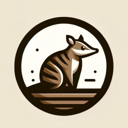

# Numbast (Python package)

Auto-generates Numba CUDA-compatible bindings from ast_canopy-parsed CUDA C++ declarations.

The documentation has moved. Please visit:

- Quickstart: `https://nvidia.github.io/numbast/latest/quickstart.html`
- Supported declarations: `https://nvidia.github.io/numbast/latest/supported_declarations.html`
- API reference: `https://nvidia.github.io/numbast/latest/api_reference.html`
